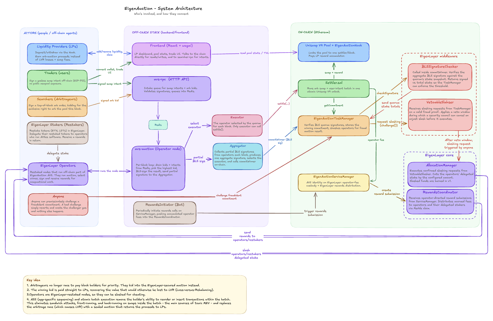

<p align="center">
  
</p>

# EigenAuction — LVR Auction Hook for Uniswap V4

EigenAuction is a Uniswap V4 hook that gives liquidity providers back the value MEV usually takes from them. Every block, the right to arbitrage the pool is sold in a sealed auction secured by an EigenLayer AVS. The winning bid is paid to the LPs who hold the liquidity, instead of leaking to searchers and block builders.

---

## Contents

- [Current project state](#current-project-state)
- [The problem](#the-problem)
- [The solution](#the-solution)
  - [What is application-specific sequencing](#what-is-application-specific-sequencing)
- [Architecture](#architecture)
- [Repository layout](#repository-layout)
- [Quick start](#quick-start)
- [Tests](#tests)
- [Contributing](#contributing)
- [More documentation](#more-documentation)

---

## Current project state

This project is in **active development**, so the code, documentation and diagrams will keep changing. Once it is live on a testnet, this section will say so.

The on-chain side has moved to a **BLS operator-set design**: auction results are attested by a stake-weighted quorum of the operator set, verified on-chain through EigenLayer's BLS middleware, and only then settled. The smart contracts for this (commit, settle, challenge, slash, rewards) are implemented and tested. The backend and frontend requires an update - see their READMEs.

If you want to contribute, the open areas are:

- **Backend aggregator** — collect partial BLS signatures from operator nodes each block, aggregate them, select the executor off-chain, and submit the commitment on-chain. The current `signer.ts` still does single-operator ECDSA signing and needs to be replaced.
- **Operator node** — BLS keygen, registration through the registry coordinator, and the per-block auction loop.
- **Frontend** — LP dashboard, a swap widget that signs a `SwapIntent` and sends it to the operator RPC, and pool statistics.

See [Contributing](#contributing) for the skills that help most.

---

## The problem

Every AMM leaks value to arbitrage. Whenever the pool price drifts from the wider market price, arbitrageurs trade against the pool to pull it back to fair value, and the profit they make comes straight out of LP pockets. This is **Loss-Versus-Rebalancing (LVR)** - a structural cost of providing liquidity, not a bug. On mainnet it accounts for a large share of what LPs lose on active pools.

Today that profit is captured by searchers and block builders through transaction ordering. LPs collect swap fees but eat the LVR. The result: providing liquidity is far less profitable than it looks.

---

## The solution

EigenAuction turns that leak into LP revenue. Instead of letting searchers race to extract the arbitrage for free, the protocol **sells the arbitrage right** and pays the proceeds to LPs.

Each block:

1. **Searchers bid.** An arbitrageur signs a top-of-block order (`ToBOrder`) describing the trade it wants to run. The bid is the surplus that order leaves on the table, and it is always denominated in `currency0`.
2. **The operator set picks the winner.** A stake-weighted BLS quorum of EigenLayer operators agrees off-chain on the winning order, the user swaps to include, a single clearing price, and which operator will submit it. They co-sign that result.
3. **The result is committed on-chain.** The aggregated BLS signature is verified against the operator set's stake. Once the commitment exists, only the pre-selected operator (the *executor*) can settle it.
4. **One atomic settlement.** The executor calls `settle()`. Inside a single Uniswap V4 unlock, the arbitrage runs first, then all user swaps clear at one uniform price. The arbitrage bid is folded into LP rewards proportional to in-range liquidity.
5. **Cheating is punished.** Anyone can submit a strictly-better signed order within the challenge window. If they do, the operators who signed the bad result are slashed on EigenLayer.

The net effect: the arbitrage profit that used to leak to searchers is paid back to the LPs who actually carry the risk.

### What is application-specific sequencing

Normally, the order of transactions inside a block is decided by the block proposer/builder. That ordering power is exactly what lets searchers sandwich, front-run, and back-run — it is where MEV comes from.

**Application-specific sequencing (ASS)** flips that around: a single application decides the order of *its own* transactions, and hands the chain one pre-ordered, atomic batch. The proposer can include or exclude the batch, but it cannot reorder, split, or insert anything into it.

EigenAuction uses this model. The pool's own operator set is the sequencer for that pool:

- exactly **one** arbitrage trade runs at the top of the block
- every user swap in the batch clears at a **single uniform price**, so there is no advantageous position to fight over inside the batch
- the whole thing executes in **one Uniswap V4 unlock**, so a builder cannot wedge a sandwich around it

Because the operators commit to the batch with a BLS quorum signature *before* it settles, the sequencing decision is accountable: it is verifiable on-chain and slashable if it was dishonest. This is the same idea Angstrom following, but our solution is secured by an EigenLayer AVS rather than a single trusted node.

---

## Architecture

The system has 3 layers: the actors who interact with the protocol (LPs, traders, searchers, operators), the off-chain stack that runs the per-block auction and submits results and the on-chain contracts that verify and settle atomically. Contracts are splitted on EigenAuction contracts and the EigenLayer infrastructure that handles quorum verification, slashing, and rewards.

Below you can see the full architecture of EigenAuction with on-chain and off-chain components and actors that use the system.



---

## Repository layout

```
src/
  contracts/                 Solidity (Foundry) — see src/contracts/README.md
    src/
      EigenAuctionHook.sol            V4 hook: pool lock + LP reward accumulator
      EigenAuctionServiceManager.sol  EigenLayer AVS identity, fee custody, rewards
      EigenAuctionTaskManager.sol     BLS commit, fraud challenge, slashing
      Settler.sol                     Atomic batch settlement (arb + uniform-price intents)
      interfaces/                     Public interfaces
      types/                          ToBOrder, SwapIntent, Commitment, Position, PoolRewards
      libraries/                      Errors, Events, Constants, reward-growth math
    script/                           Deploy + middleware wiring (Foundry)
    test/                        

  backend/
    avs-auction/             Operator node — per-block auction loop (being updated for BLS)
    searcher-rpc/            HTTP API — signed intent + bid intake
    shared/                  Config, ABIs, types

  frontend/
    app/                     React SPA — LP dashboard, trade view, pool stats
      chain/                 wagmi hooks, deployment artifact loader, V4 math

deployments/                 JSON artifacts written by deploy scripts, read by backend + frontend
docs/assets/                 Diagrams + images
```

---

## Quick start

> This section requires update. Below instructions may not work correctly at the moment because the backend and frontend requires changes after moving to BLS signing.

### Sepolia testnet

```bash
cp .env.example .env           # fill SEPOLIA_RPC_URL, DEPLOYER_PK, OPERATOR_PK, ETHERSCAN_API_KEY
make deploy-testnet            # deploy contracts, write deployments/11155111.json
make up                        # start the off-chain services
```

### Local mainnet fork

```bash
make anvil-fork                # terminal 1: fork mainnet
make fund deploy-fork seed     # terminal 2: fund wallets + deploy + seed an LP position
make start-server              # searcher-rpc
make start-operator            # avs-auction operator
make frontend-dev              # Vite dev server
```

---

## Tests
> Contracts tests work as expected and they are up to date. Backen tests requires update.

```bash
make test          # all tests: forge (Solidity) + vitest (TypeScript)
make build         # compile contracts only
```

---

## Contributing

Everyone is welcome. You'll be especially useful if you know:

- **Uniswap V3/V4 and hooks** — the auction design and the reward accumulator.
- **EigenLayer AVS operator software** (think EigenDA, Lagrange, or Espresso operator nodes). BLS cryptography over BLS12-381 and P2P networking (libp2p or similar) for operator-to-aggregator messaging is a big plus.
- **Application-specific sequencing** — how per-block ordering works (Angstrom-style), both for the auction and for how the operator selects and commits the winning `ToBOrder`.
- **Frontend web3** — the standard wagmi/viem + EIP-712 signing stack.

---

## Documentation

- [src/contracts/README.md](src/contracts/README.md)
- [src/backend/README.md](src/backend/README.md)
- [src/frontend/README.md](src/frontend/README.md)
</content>
