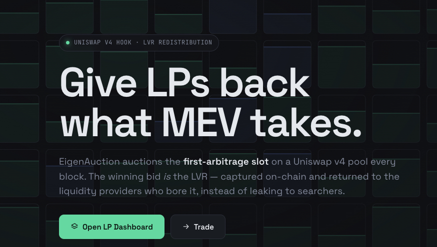
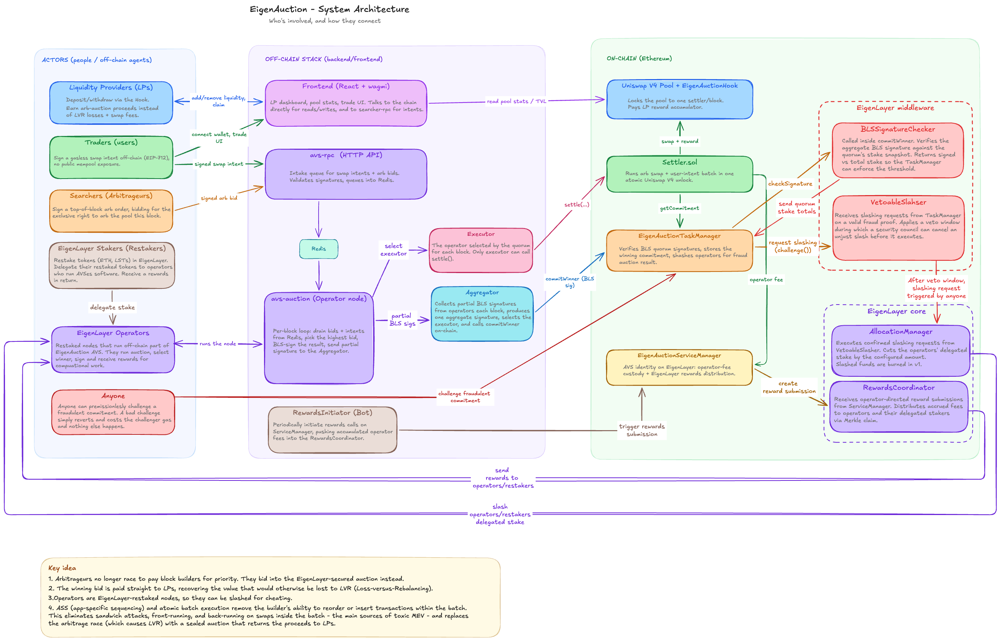
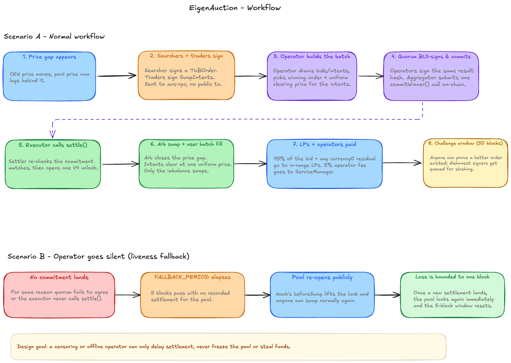

<p align="center">
  
</p>

# EigenAuction — LVR Auction Hook for Uniswap V4

EigenAuction is a Uniswap V4 hook that gives liquidity providers back the value MEV usually takes from them. Every block, the right to arbitrage the pool is sold in a sealed auction secured by an EigenLayer AVS. The winning bid is paid to the LPs who hold the liquidity, instead of leaking to searchers and block builders.

---

## Contents

- [Current project state](#current-project-state)
- [The problem](#the-problem)
- [The solution](#the-solution)
  - [What is application-specific sequencing](#what-is-application-specific-sequencing)
- [Architecture & Workflows](#architecture)
- [Repository layout](#repository-layout)
- [Quick start](#quick-start)
- [Running the project with Aspire](#running-the-project-with-aspire)
- [Tests](#tests)
- [Contributing](#contributing)
- [Documentation](#documentation)

---

## Current project state

This project is in **active development**, so the code, documentation and diagrams will keep changing. Once it is live on a testnet, this section will say so.

The full **multi-operator BLS design** runs end-to-end on a local mainnet fork: searchers/users submit signed orders and intents to the relay, N EigenLayer operators independently recompute the block's result and BLS-sign it, the aggregator commits the stake-weighted quorum signature on-chain via `EigenAuctionTaskManager.commitWinner`, and the drawn executor settles — commit and settle in the same block. The off-chain half is a Go module (`avs/`); the whole local stack is orchestrated with [Aspire](#running-the-project-with-aspire).

What works today:

- **Contracts** — commit, settle, challenge/slash, rewards, and the LP liveness fallback (`FALLBACK_PERIOD`), implemented and tested.
- **Go AVS** (`avs/`) — operator node (seal --> resolve --> BLS-sign --> settle-if-drawn), aggregator (BLS aggregation --> `commitWinner`), and operator-set registration. The executor draw reads the live operator set from `OperatorStateRetriever`, so it scales to N operators. See [avs/README.md](avs/README.md).
- **Relay** (`apps/backend`) — the seal endpoint: order/intent intake + the per-block canonical sealed set with a live clearing price. See [apps/backend/README.md](apps/backend/README.md).
- **Frontend** — LP dashboard + a swap widget that signs a `SwapIntent` and posts it to the relay.

Open / next: a live N-operator run on the fork, the challenge/`_proveFraud` slash path end-to-end, and mainnet submission via a Flashbots bundle (replacing the local `drive-round` mining choreography). See [Contributing](#contributing).

---

## The problem

Every AMM leaks value to arbitrage. Whenever the pool price drifts from the wider market price, arbitrageurs trade against the pool to pull it back to fair value, and the profit they make comes straight out of LP pockets. This is **Loss-Versus-Rebalancing (LVR)** - a structural cost of providing liquidity, not a bug. On mainnet it accounts for a large share of what LPs lose on active pools.

Today that profit is captured by searchers and block builders through transaction ordering. LPs collect swap fees but eat the LVR. The result: providing liquidity is far less profitable than it looks.

---

## The solution

EigenAuction turns that leak into LP revenue. Instead of letting searchers race to extract the arbitrage for free, the protocol **sells the arbitrage right** and pays the proceeds to LPs.

Each block:

1. **Searchers bid.** An arbitrageur signs a top-of-block order (`ToBOrder`) describing the trade it wants to run. The bid is the surplus that order leaves on the table, and it is always denominated in `currency0`.
2. **The operator set picks the winner.** A stake-weighted BLS quorum of EigenLayer operators agrees off-chain on the winning order, the user swaps to include, a single clearing price, and which operator will submit it. They co-sign that result.
3. **The result is committed on-chain.** The aggregated BLS signature is verified against the operator set's stake. Once the commitment exists, only the pre-selected operator (the *executor*) can settle it.
4. **One atomic settlement.** The executor calls `settle()`. Inside a single Uniswap V4 unlock, the arbitrage runs first, then all user swaps clear at one uniform price. The arbitrage bid is folded into LP rewards proportional to in-range liquidity.
5. **Cheating is punished.** Anyone can submit a strictly-better signed order within the challenge window. If they do, the operators who signed the bad result are slashed on EigenLayer.

The net effect: the arbitrage profit that used to leak to searchers is paid back to the LPs who actually carry the risk.

### What is application-specific sequencing

Normally, the order of transactions inside a block is decided by the block proposer/builder. That ordering power is exactly what lets searchers sandwich, front-run, and back-run — it is where MEV comes from.

**Application-specific sequencing (ASS)** flips that around: a single application decides the order of *its own* transactions, and hands the chain one pre-ordered, atomic batch. The proposer can include or exclude the batch, but it cannot reorder, split, or insert anything into it.

EigenAuction uses this model. The pool's own operator set is the sequencer for that pool:

- exactly **one** arbitrage trade runs at the top of the block
- every user swap in the batch clears at a **single uniform price**, so there is no advantageous position to fight over inside the batch
- the whole thing executes in **one Uniswap V4 unlock**, so a builder cannot wedge a sandwich around it

Because the operators commit to the batch with a BLS quorum signature *before* it settles, the sequencing decision is accountable: it is verifiable on-chain and slashable if it was dishonest. This is the same idea Angstrom following, but our solution is secured by an EigenLayer AVS rather than a single trusted node.

---

## Architecture & Workflows

The system has four layers: the actors who interact with the protocol (LPs, traders, searchers, operators), the off-chain stack that runs the per-block auction and submits results, the on-chain EigenAuction contracts that verify and settle atomically, and the EigenLayer infrastructure that handles quorum verification, slashing, and rewards.

Below you can see the full architecture of EigenAuction with on-chain and off-chain components and actors that use the system.

### Architecture


### Workflows

---

## Repository layout

The TypeScript code is a pnpm-workspaces monorepo (`apps/` + `packages/`); the Go AVS is a separate
module under `avs/`; the Solidity project is a standalone Foundry root under `src/contracts/`.

```
src/contracts/               Solidity (Foundry) — see src/contracts/README.md
  src/
    EigenAuctionHook.sol            V4 hook: pool lock + LP reward accumulator + liveness fallback
    EigenAuctionServiceManager.sol  EigenLayer AVS identity, fee custody, rewards
    EigenAuctionTaskManager.sol     BLS commit, fraud challenge, slashing
    Settler.sol                     Atomic batch settlement (arb + uniform-price intents)
    interfaces/  types/  libraries/
  script/                           Deploy + middleware wiring (Foundry)
  test/

avs/                         Go — the off-chain AVS (operator + aggregator). See avs/README.md
  cmd/                       binaries: operator, aggregator, register
  internal/                  consensus core, chain adapter, feed, agg, attest, node

apps/ + packages/            pnpm workspaces (TypeScript)
  packages/shared/           @eigen-auction/shared — config, ABIs, types, EIP-712 signing
  apps/backend/              @eigen-auction/backend — the relay (avs-rpc) + round/searcher scripts
    src/avs-rpc/             HTTP relay: /order, /intent intake + GET /auction/:block seal
    src/scripts/             post-batch, drive-round, approve
  apps/frontend/             @eigen-auction/frontend — React SPA (LP dashboard, trade view)

aspire-apphost/              Aspire AppHost (apphost.mts) — local orchestrator for all services
deployments/                 JSON artifacts written by deploy scripts, read by every stack
docs/                        
```

---

## Quick start

### Prerequisites 
- [Foundry](https://book.getfoundry.sh/) 
- Node 20+ with `pnpm`
- Go 1.22+ 
- And (for the
orchestrated run) the [Aspire CLI](https://aspire.dev)
- Copy `.env.example` to `.env` and fill it in

### Local mainnet fork (the primary dev flow)

```bash
# terminal 1 — keep this running
make anvil-fork                          # fork mainnet at chainId 1 (real USDC/WETH)

# terminal 2 — one-time chain setup
pnpm install
make fund deploy-fork seed-pool approve  # fund wallets, deploy, seed pool liquidity, set approvals
make fund-operator-stake register \               # register operator 1 into the operator set (BLS pubkey + stake)
  STAKE_AMOUNT=1000000000000000000 STAKE_MAGNITUDE=1000000000000000000
# for N operators, repeat fund-operator/fund-operator-stake/register per keyset
```

Then bring the services up with Aspire and drive a round (see
[Running with Aspire](#running-the-project-with-aspire)):

```bash
cd aspire-apphost && aspire run          # redis + relay + aggregator + N operators + frontend
make drive-round                         # post a batch, mine one block --> commit + settle same block
```

### Sepolia testnet

```bash
make deploy-testnet   # deploy contracts + register, write deployments/11155111.json
make up               # docker stack (redis + relay + frontend) --> http://localhost:8080
```

---

## Running the project with Aspire

The long-running services (redis, the relay, the aggregator, N operators, the frontend) are
orchestrated by a **Aspire** AppHost written in TypeScript ([aspire-apphost/apphost.mts](aspire-apphost/apphost.mts)).
It gives you one command to start the whole graph, a dashboard with per-service logs/traces, and
consistent env wiring. Aspire manages the *services*; the chain setup (anvil, deploy, seed, register)
stays in `make`/`forge`, and a round is still driven with `make drive-round`.

```bash
curl -sSL https://aspire.dev/install.sh | bash   # install the Aspire CLI (once; needs Node 20+)
cd aspire-apphost && aspire run                  # starts every service + opens the dashboard
```

- Operators are **local-only**: the AppHost adds them only when `APP_ENV=local` (the default). On
  testnet/mainnet, operators are independent third parties and are not hosted here.
- The one prod secret (the aggregator key) is an Aspire **secret parameter**; other config comes from
  the repo-root `.env`.

### Testing the full flow

1. Complete the fork setup above (`anvil-fork` --> `fund deploy-fork seed-pool approve` --> register).
2. `aspire run` — confirm all services are green in the dashboard (`curl localhost:8088/health`).
3. `make drive-round` — posts searcher orders + a user intent, then mines the target block. In the
   dashboard you should see every operator log the **same** `executor`, the aggregator log `committed …`,
   and the drawn operator log `settle submitted …`.

---

## Tests

```bash
make test           # TypeScript (vitest) + Solidity (forge) — see Makefile
make avs-test       # Go AVS unit tests (consensus core, chain, feed, operator)
make avs-integration # Go core cross-checked against the deployed Settler (needs a running fork)
make build          # compile contracts only
```

---

## Contributing

Everyone is welcome. You'll be especially useful if you know:

- **Uniswap V3/V4 and hooks** — the auction design and the reward accumulator.
- **EigenLayer AVS operator software** (think EigenDA, Lagrange, or Espresso operator nodes). BLS cryptography over BLS12-381 and P2P networking (libp2p or similar) for operator-to-aggregator messaging is a big plus.
- **Application-specific sequencing** — how per-block ordering works (Angstrom-style), both for the auction and for how the operator selects and commits the winning `ToBOrder`.
- **Frontend web3** — the standard wagmi/viem + EIP-712 signing stack.

---

## Documentation

- [src/contracts/README.md](src/contracts/README.md) — Solidity contracts
- [avs/README.md](avs/README.md) — Go AVS (operator, aggregator, register, consensus core)
- [apps/backend/README.md](apps/backend/README.md) — the relay + scripts
- [apps/frontend/README.md](apps/frontend/README.md) — React SPA
</content>
