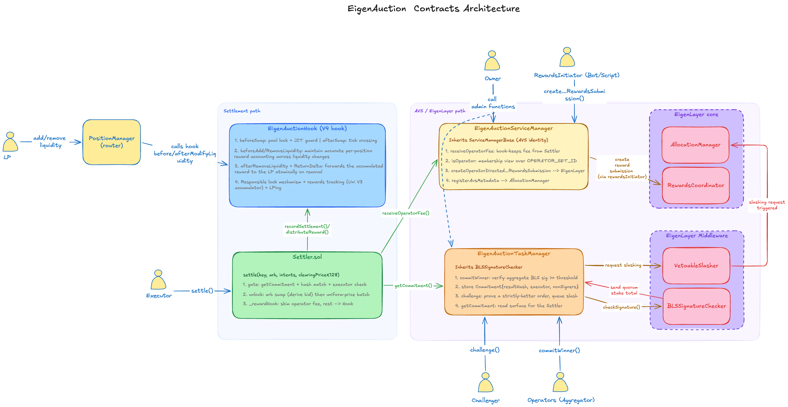

# EigenAuction Contracts

The on-chain part of EigenAuction. Four contracts run a per-block, BLS-secured arbitrage auction on a Uniswap V4 pool and return the proceeds to liquidity providers. A stake-weighted quorum of EigenLayer operators attests each block's result off-chain; the chain verifies that attestation, settles the batch atomically, and slashes operators who attest a worse-than-honest result.

---

## Contents

- [Architecture](#architecture)
- [Design approaches](#design-approaches)
- [Contracts](#contracts)
  - [EigenAuctionHook](#eigenauctionhook)
  - [Settler](#settler)
  - [EigenAuctionTaskManager](#eigenauctiontaskmanager)
  - [EigenAuctionServiceManager](#eigenauctionservicemanager)
- [How BLS signatures are used](#how-bls-signatures-are-used)
- [How the AVS works](#how-the-avs-works)
  - [Committing a result](#committing-a-result)
  - [Settling a result](#settling-a-result)
  - [Challenging and slashing](#challenging-and-slashing)
  - [Rewarding operators and stakers](#rewarding-operators-and-stakers)
- [Full settlement flow](#full-settlement-flow)
- [Types](#types)
- [Libraries and constants](#libraries-and-constants)
- [Known limitations](#known-limitations)
- [Tests](#tests)
- [Deployment](#deployment)

---

## Architecture

Four contracts, split by concern. The thing that ties them together is a **commitment**: a per-block record, attested by the operator set, of exactly which batch may settle and who may submit it.



| Contract | Responsibility |
|---|---|
| `EigenAuctionHook` | V4 hook: lock the pool to one settler, run the LP reward accumulator |
| `Settler` | Re-check the commitment, gate on the executor, run the batch in one V4 unlock |
| `EigenAuctionTaskManager` | Verify the BLS quorum, store commitments, judge fraud challenges, queue slashing |
| `EigenAuctionServiceManager` | AVS identity on EigenLayer: metadata, operator-fee custody, reward submission |

The TaskManager pulls in the EigenLayer BLS middleware (`^0.8.27`). The Settler and hook live on Uniswap's `0.8.26`. To keep those graphs apart, the Settler reads commitments through **`ICommitmentReader`** — a tiny, EigenLayer-free interface (just `getCommitment`) that the TaskManager also implements. The shared `Commitment` struct lives in `types/` for the same reason. So the low-pragma settlement path never imports the high-pragma middleware.

---

## Design approaches

- **Commit, then settle.** Nothing executes until a quorum-attested commitment exists for `(poolId, block.number)`. Settlement re-derives the batch hash and matches it against the commitment, so an operator can only push the batch the quorum actually signed off on.
- **Same-block commitment.** The commitment's mapping key is the block it settles in, the arbitrage order is bound to `validForBlock == block.number`, and `settle` reads `getCommitment(poolId, block.number)`. A stale commitment simply can't be replayed in a later block. Liveness, if the chosen executor goes silent, falls through to the hook's public fallback rather than a cross-block rescue window.
- **The executor is a pure relay.** The operator allowed to call `settle` is chosen off-chain, but its address is part of the BLS-signed message — so the quorum (not any single operator) decides who settles. A dishonest executor can at most censor (not settle), which the fallback handles. **The executor is never slashed.**
- **Defense in depth on orders.** The BLS quorum replaces a single trusted sequencer, but it does **not** replace per-order signatures. Every `ToBOrder` and `SwapIntent` is still EIP-712 signed by its originator and re-verified on-chain at settle time.
- **Terms, not signatures, are hashed.** The committed `resultHash` and all on-chain checks hash order *terms*, never signatures. This keeps the commitment immune to signature malleability and gives one canonical encoding (`Settler.computeResultHash`) shared by the contracts and the off-chain aggregator.
- **Atomic, single-unlock settlement.** The arbitrage and the whole user batch run inside one `poolManager.unlock`, with a solvency check that reverts the batch if it can't pay out. Builders cannot wedge anything into the middle.

---

## Contracts

### EigenAuctionHook

A Uniswap V4 hook (`beforeSwap`, `afterSwap`, `beforeAddLiquidity`, `beforeRemoveLiquidity`, `afterRemoveLiquidity`) that locks the pool and pays LPs.

**Pool lock.** Once the owner calls `setSettler` (once), only that settler may move the pool price, at most once per block (`recordSettlement`). Any other swap is rejected — unless `FALLBACK_PERIOD` (5) blocks pass with no settlement, at which point the pool re-opens to public swaps so a stalled operator can't freeze it forever.

**JIT guard.** Before the arbitrage swap, the Settler snapshots pool liquidity and passes it in `hookData`. `beforeSwap` reverts if liquidity changed, so nobody can add just-in-time liquidity to skim a block's reward and leave.

**Reward accumulator.** Rewards (always `currency0`) use the Uniswap V3-style growth pattern. A per-pool `PoolRewards` accumulator tracks cumulative reward-per-unit-liquidity; each tick boundary stores its "outside" value, flipped as swaps cross it; each position checkpoints the inside value it last saw. `distributeReward` folds the arbitrage bid into the accumulator for **whoever is in range now**.

LPs use the standard V4 `PositionManager` (or any V4 router) — no custom entry point. The hook's `before`-hooks maintain accurate per-position reward accounting across liquidity changes: `beforeAdd/RemoveLiquidity` snapshots the current reward growth inside the tick range and settles what the position earned since its last checkpoint. `afterRemoveLiquidity` + `ReturnDelta` pays the accrued reward to the LP atomically on removal by funding the `PoolManager` and returning a negative currency0 delta so V4 credits the caller. A zero-delta removal (no principal change) collects rewards without closing the position.

### Settler

One Settler per chain, registered on each pool's hook and on the AVS. The executor calls `settle(key, arbitrage, intents, clearingPriceX128)` once per pool per block.

**Gating (before any state change):**
1. read `taskManager.getCommitment(poolId, block.number)` — must exist,
2. `computeResultHash(arbitrage, clearingPriceX128, intents)` must equal the committed `resultHash`,
3. `msg.sender` must equal the committed `executor`.

**Step 1 — top-of-block arbitrage.** The signed `ToBOrder` runs as one AMM swap. The LP reward (bid) is *derived on-chain* in `currency0` as the gap between the AMM's deterministic quote and the order's amounts (`quantityIn - ammIn` for `zeroForOne`, `ammOut - quantityOut` otherwise). The operator cannot fake or inflate it — it is a function of pool state and the signed order.

**Step 2 — uniform-clearing-price batch.** Every `SwapIntent` clears at the single operator-supplied `clearingPriceX128`. Opposite directions net against each other; only the leftover imbalance touches the AMM as one swap. Each fill must meet the signer's `minAmountOut`, the batch must be solvent (or it reverts), and any `currency0` residual goes to LPs.

**Operator fee.** `_rewardHook` is the single choke point for captured `currency0`. It skims `operatorFeeBps` (default 5%, capped at 20%), forwards it to the ServiceManager, and sends the remainder to the hook for LP distribution. Nonces are a packed bitmap per user; `invalidateNonce` lets a user cancel a pending intent.

### EigenAuctionTaskManager

Inherits EigenLayer's `BLSSignatureChecker`. This is where the operator set's attestation happens.

- `commitWinner(...)` — verify the aggregate BLS signature against quorum stake, enforce the threshold, and store the `Commitment`.
- `getCommitment(poolId, targetBlock)` — the Settler-facing read surface (`ICommitmentReader`).
- `challenge(...)` — prove a committed result was fraudulent and queue slashing of the signers.
- Owner-tunable (gated by the registry coordinator owner): quorum numbers, stake threshold, slashing config, and the Settler address used to verify challenged order signatures.

### EigenAuctionServiceManager

Inherits `ServiceManagerBase`. The AVS's identity and rewards distributor, not its logic.

- `registerAvsMetadata` — register the AVS with EigenLayer's `AllocationManager` (once, before the operator set is created).
- `isOperator` — membership view over `OPERATOR_SET_ID`.
- `receiveOperatorFee` — entry point for the Settler calls to forward the fee.
- `createOperatorDirected...RewardsSubmission` — push operator + staker rewards through the `RewardsCoordinator` from fees already held inside ServiceManager.

Operators register through the `SlashingRegistryCoordinator` (the AVS registrar), which is what sets their BLS public keys in the APK registry.

---

## How BLS signatures are used

Each operator holds a **BLS key** (BLS12-381 curve). Every block, all operators sign the *same* 32-byte message — the digest of the auction result:

```
resultHash = keccak256(arbOrderHash, clearingPriceX128, intentsRoot)
msgHash = keccak256(poolId, targetBlock, resultHash, executor)
```

BLS signatures have one property ECDSA does not: **they aggregate**. Many individual signatures over the same message combine into a *single* constant-size signature, and the matching public keys combine into a single aggregate public key. The chain then checks the entire quorum with **one pairing check** instead of N separate `ecrecover` calls.

On-chain, the inherited `BLSSignatureChecker.checkSignatures` does the work. The aggregator submits a `NonSignerStakesAndSignature` containing the aggregate signature plus the public keys of the operators that *didn't* sign. The checker takes the quorum's aggregate public key snapshot at `referenceBlockNumber`, subtracts the non-signers, verifies the pairing, and returns the signed vs total stake per quorum. The TaskManager then enforces the threshold itself, as a cross-multiplication so there's no division or rounding:

```solidity
signedStake * BPS >= totalStake * thresholdBps   // per quorum
```

Threshold is a network setting: **≥66% on mainnet** (2/3 BFT threshold — an attacker needs >1/3 of restaked stake to forge a commitment) and **≥51% on testnet** (simple majority, operator set is small and trusted during development).

Why this matters here:

- **O(1) verification.** Cost is flat no matter how many operators sign, so the set can grow without making settlement more expensive.
- **Stake-weighted safety.** A commitment exists only if operators controlling enough restaked stake signed it — that stake is what's at risk if they lie.
- **Trustless executor selection.** The executor address is *inside* the signed `msgHash`, so a quorum of stake attests who settles. No lone operator can nominate itself.
- **Recoverable signer set.** The commitment stores `hashOfNonSigners = keccak256(referenceBlockNumber, nonSignerPubkeyHashes)`. That record is exactly what later lets a challenge prove *who* signed a fraudulent result, so the right operators get slashed.

---

## How the AVS works

### Committing a result

Off-chain, operators run the auction, agree on the winning `ToBOrder`, the uniform clearing price, the set of intents, and the executor, and BLS-sign `msgHash`. The aggregator combines the signatures and calls:

```solidity
function commitWinner(
    PoolId poolId,
    uint256 targetBlock,
    bytes32 resultHash,
    address executor,
    uint32 referenceBlockNumber,
    bytes calldata quorums,
    NonSignerStakesAndSignature calldata nonSignerStakesAndSignature
) external
```

It rejects a zero executor, a `targetBlock` that isn't the current block, a `referenceBlockNumber` that isn't strictly in the past, mismatched quorum numbers, and a pool/block already committed (the cheap checks run *before* the expensive pairing). Then it verifies the quorum, enforces the threshold, and stores `Commitment{resultHash, hashOfNonSigners, executor, exists, challenged}`.

### Settling a result

Covered above under [Settler](#settler): the executor's `settle` re-derives the result hash, matches it against the commitment, checks the executor, and runs the batch atomically. Because the commitment is keyed by block and the arb is bound to that block, there's no replay surface.

### Challenging and slashing

For `CHALLENGE_WINDOW` (50) blocks after the target block, **anyone** can dispute a commitment by supplying a genuinely better signed order:

```solidity
function challenge(
    PoolId poolId, uint256 targetBlock,
    ToBOrder committedArb, 
    uint256 clearingPriceX128, 
    bytes32 intentsRoot,
    ToBOrder dominantOrder,
    uint32 referenceBlockNumber, 
    bytes32[] nonSignerPubkeyHashes
) external
```

The proof is fully on-chain and needs no historical pool data:

1. `committedArb` must rebuild the commitment's `resultHash` — proving it's the order the quorum really attested.
2. `dominantOrder` must target the same pool, block, and direction.
3. `dominantOrder` must **strictly dominate**: pay `>=` and want `<=`, strict in at least one. That guarantees a strictly larger `currency0` bid for *any* AMM state.
4. `dominantOrder` must carry a valid searcher signature under the Settler's EIP-712 domain.

If all above is valid, the commitment is marked `challenged` and slashing is queued. To find the signers, the challenger re-supplies the non-signer pubkey hashes which are checked against the commitment's `hashOfNonSigners`. The full operator set is read from the `IndexRegistry` snapshot at `referenceBlockNumber`, and **signers = full set − non-signers − executor**. Each signer gets a `VetoableSlasher.queueSlashingRequest`. The veto window lets a security council cancel an unjust slash before it executes. On execution, `AllocationManager` slashes the configured strategies by `wadToSlash`. Slashed funds are **burned** in v1. The executor, as a pure relay, is never in the slashed set.

### Rewarding operators and stakers

The 5% operator fee is taken at settle time accrues in the ServiceManager. A `rewardsInitiator` keeper periodically pushes an **operator-directed** submission through EigenLayer's `RewardsCoordinator`, weighting operators by their signing and execution participation (computed off-chain — EigenLayer applies operator splits and staker weighting itself). Rewards then flow to operators **and their delegated stakers** through the standard Merkle claim. Honest participation pays; the same stake is what gets slashed for fraud.

---

## Full settlement flow

```
1. AUCTION (off-chain)
   operators agree on winning ToBOrder, uniform price, intents, executor
   each BLS-signs msgHash; aggregator aggregates

2. COMMIT (aggregator, same block)
   taskManager.commitWinner(poolId, block.number, resultHash, executor, refBlock, quorums, aggSig)
   --> checkSignatures >= threshold, store Commitment

3. SETTLE (executor, same block)
   settler.settle(key, arbitrage, intents, clearingPriceX128)
   --> getCommitment(poolId, block.number): exists, resultHash matches, msg.sender == executor
   --> hook.recordSettlement(poolId)            (once per block)
   --> poolManager.unlock:
        a. arbitrage swap; derive currency0 bid on-chain
        b. uniform-price batch: net intents, swap the imbalance, pay each fill, check solvency
        c. _rewardHook: take operatorFee --> ServiceManager; remainder --> hook.distributeReward

4. CHALLENGE WINDOW (anyone, 50 blocks)
   taskManager.challenge(...) on a strictly-better signed order
   --> mark challenged, queue VetoableSlasher requests for the signatory set (executor excluded)

5. LP REWARDS (any later removeLiquidity via V4 router)
   hook pays earned() in currency0 automatically via afterRemoveLiquidity + ReturnDelta;
   a zero-delta poke (liquidityDelta=0) collects rewards without closing the position

6. OPERATOR REWARDS (rewards keeper, periodic)
   serviceManager pushes operator-directed rewards from accrued fees --> operators + stakers
```

---

## Types

| Type | Purpose |
|---|---|
| `ToBOrder` | A searcher's signed arbitrage order — the "bid" to be first in the block. Contains the pool, direction, and token amounts the searcher commits to (`quantityIn` / `quantityOut`). There is no explicit bid field: the LP reward is derived on-chain as the gap between what the AMM quotes and what the searcher offered. Operators simulate this off-chain to rank bids; the chain re-derives the same number at settle time so it can't be inflated. |
| `SwapIntent` | A user's signed off-chain swap request. The user signs it with their wallet (EIP-712, no gas) and sends it to the Searcher RPC. No tx to the public mempool happenning here. The operator bundles valid intents into the same block as the arbitrage, and they all clear at one uniform price set by the operator. Includes slippage protection (`minAmountOut`) and replay protection (`nonce`, `deadline`). |
| `Commitment` | The per-block on-chain record that the operator set agreed on. Once a quorum-attested `commitWinner` stores it, it locks in `resultHash` (a hash of the arbitrage order + clearing price + intents), `executor` (the one address allowed to call `settle` this block), and `hashOfNonSigners` (used later to reconstruct exactly who signed, so the right operators get slashed on a valid fraud proof). Lives in `types/` with no EigenLayer imports so the low-pragma Settler and hook can read it without pulling in the BLS middleware. |
| `Position` / `PoolRewards` | Internal accounting for the LP reward accumulator. `PoolRewards` holds the global reward-per-unit-liquidity counter for each pool (grows every time an arbitrage bid is distributed). `Position` stores the checkpoint each LP last saw — the difference at claim time, multiplied by their liquidity, is what they're owed. This is the same pattern Uniswap V3 uses for fee accounting. |

`ToBOrderLib.toBStructHash` and `SwapIntentLib.intentStructHash` produce the canonical EIP-712 hash for each type — shared by the Settler (settlement), the TaskManager (fraud proof), and the off-chain aggregator (signing). This ensures a challenge and a settlement always hash an order identically, so there's no ambiguity about what the quorum actually signed.

---

## Libraries and constants

`RewardGrowthLib`, `PoolRewardsLib`, `TickCrossingLib` — the V3-style reward-growth math (global accumulator, tick-outside flips, inside derivation), kept `unchecked` to match V3's wrapping semantics. `ErrorsLib` / `EventsLib` centralize every custom error and event.

`ConstantsLib`:

| Constant | Value | Meaning |
|---|---|---|
| `CHALLENGE_WINDOW` | 50 | Blocks after the target block during which a fraud proof is accepted |
| `FALLBACK_PERIOD` | 5 | Blocks with no settlement before the hook re-opens public swaps |
| `OPERATOR_SET_ID` | 0 | EigenLayer operator-set / quorum id this AVS uses |
| `BPS` | 10000 | Basis-point denominator (thresholds, fees) |
| `DEFAULT_OPERATOR_FEE_BPS` | 500 | Default operator fee at deploy (5%) |
| `MAX_OPERATOR_FEE_BPS` | 2000 | Max operator fee available (20%) — keeps the LP share dominant |

---

## Known limitations

- **Censoring executor.** A dishonest executor can decline to settle. It cannot push a different batch (commitment match) or settle late (same-block binding); the loss is bounded to that block's auction and resolved by the hook's public fallback after `FALLBACK_PERIOD`.
- **Reward stranded at zero liquidity.** If the arbitrage pushes the price past all active positions so `poolLiquidity == 0` after the swap, there's no in-range LP to credit and that block's bid has no owner.
- **`ServiceManagerBase` view stubs.** `getRestakeableStrategies` / `getOperatorRestakedStrategies` return empty arrays — strategy config is handled through `AllocationManager`, not the legacy stake-registry path. A clean custom base is planned.

---

## Tests

```bash
forge test --root src/contracts -vvv

or from contracts directory: forge test -vvv
```

---

## Deployment
> Once deployments will be done on the testnet, all the addresses of the deployed contracts will be listed in this section.

```bash
make deploy-testnet     # Sepolia: contracts + BLS middleware stack, writes deployments/11155111.json
make deploy-fork        # local mainnet fork: real USDC/WETH, writes deployments/1.json
```

- `script/base/DeployMiddleware.sol` - deploys and wires the EigenLayer BLS stack (registry coordinator + stake/BLS/index/socket registries + `OperatorStateRetriever` + `VetoableSlasher`), sets the coordinator as the AVS registrar, grants the UAM appointees, and creates the single slashable quorum 0. 
- `script/base/DeployCore.sol` then deploys the hook, settler, task manager, and service manager and wires them together (`hook.setSettler`, `taskManager.setSettler`, AVS metadata).

Operator onboarding (BLS keygen + registration through the coordinator) and the off-chain aggregator / AVS-sync / rewards keepers live in the backend — see [../backend/README.md](../backend/README.md).
</content>
